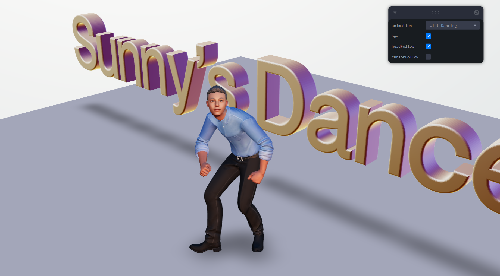
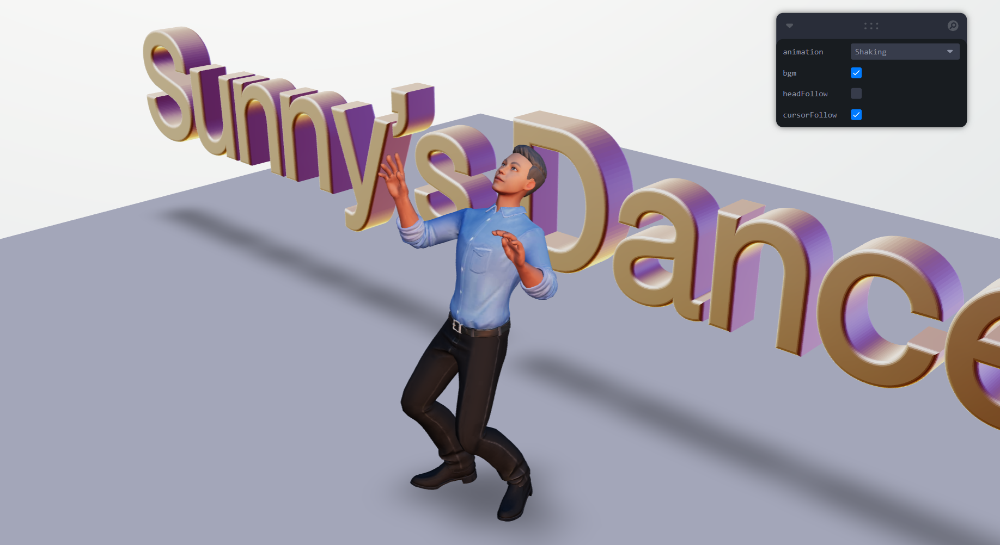

# Sunny's Dance Club

## Built With

- Vite
- React-three-fiber

## How It Works

> ⚠ PC only!

1. Turn on the bgm.
   

2. Feel free to select other dance animations to see the effect.
   

3. Try "headFollow" and "cursorFollow" to get some funny (horrible) effect.😎
   
   

## About The Project

Sunny is my dad, I made this project in order to make him laugh.

But I'm not sure if he would be happy when he saw it.

## Resources

#### 3D Avatar

[Ready Player Me](https://readyplayer.me/)

#### Music (all from [Pixabay](https://pixabay.com//?utm_source=link-attribution&utm_medium=referral&utm_campaign=music&utm_content=151674))

1. Standing Music by [Lofi_hour](https://pixabay.com/users/lofi_hour-28600719/?utm_source=link-attribution&utm_medium=referral&utm_campaign=music&utm_content=114856)

2. Swing Dancing Music by [Music_For_Videos](https://pixabay.com/users/music_for_videos-26992513/?utm_source=link-attribution&utm_medium=referral&utm_campaign=music&utm_content=110485)

3. Shaking Music by [Coma-Media](https://pixabay.com/users/coma-media-24399569/?utm_source=link-attribution&utm_medium=referral&utm_campaign=music&utm_content=117676)

4. Rumba Dancing Music by [DMD_Production](https://pixabay.com/users/dmd_production-32584949/?utm_source=link-attribution&utm_medium=referral&utm_campaign=music&utm_content=151674)

5. Uprock & Breaking Dancing Music by [royalty_free_music](https://pixabay.com/users/royalty_free_music-30304778/?utm_source=link-attribution&utm_medium=referral&utm_campaign=music&utm_content=121533)

## Tutorial

This project was inspired by this tutorial :
[Build a 3D Portfolio with React Three Fiber - Avatar animations](https://www.youtube.com/watch?v=pGMKIyALcK0)
